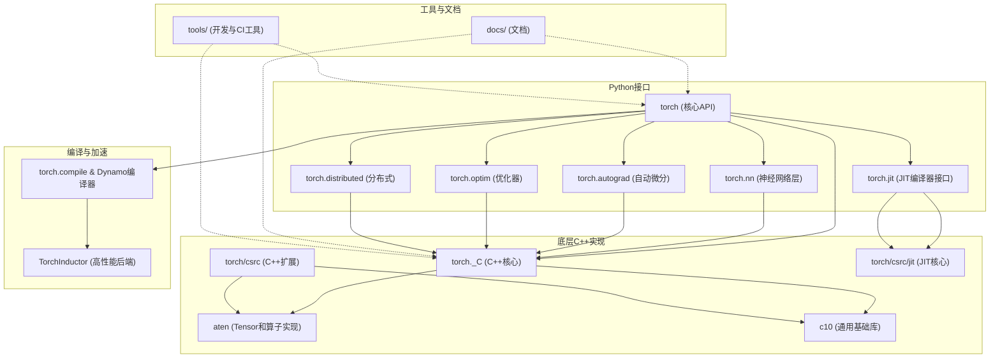

<h1 style="text-align: center;">并行算法期末大作业报告</h1>

<div style="text-align: center; font-weight: bold;">
    研究主题：基于动态计算框架的神经网络算子并行加速库——mytorch
</div>

<center>团队成员（无先后之分）：陈兴平、刘华壹、罗弘杰</center>

[TOC]

**摘要：**
123456

**关键词**：mytorch；pytorch；flashattention；OpenMP；CUDA编程；

相关代码已上传到团队仓库：[Legend717/mytorch](https://github.com/Legend717/mytorch)

### **1. 研究背景**

> 项目的详细背景以及规划可以见我们的开题报告。在此仅结合我们所作工作做简单的介绍。

#### **1.1 相关工作——pytorch**

在当今神经网络研究领域，pytorch已成为不可或缺的核心工具。作为Meta（原Facebook）开发的开源框架，它凭借动态图优先的设计哲学脱颖而出，通过`torch.autograd`在Python运行时动态构建计算图，这种机制相比TensorFlow等静态图框架更能满足科研场景的快速迭代需求。PyTorch不仅提供直观的Pythonic编程体验和高效的GPU加速能力，还集成了完整的深度学习工具链（如TorchVision、TorchText），并与Python生态无缝对接，同时通过TorchScript和ONNX支持实现便捷的模型部署。随着PyTorch 2.0引入编译优化技术并持续强化分布式训练与大模型支持（如Llama），该框架在保持科研灵活性的同时不断提升工业级性能，已成为贯穿算法探索到生产落地的首选平台。

以下是 pytorch 的框架图（使用 Mermaid 代码编写）：



我们将参考pytorch的底层实现，将其化繁为简，设计一个相对轻量化的框架mytorch来训练我们的神经网络。

#### **1.2 前沿发展——高性能算子的设计**

Attention算子是Transformer模型的核心组件之一，主要用于处理序列数据。它通过计算输入序列中各个位置之间的相关性来生成输出序列。
其集体的计算公式是
$$
\text{Attention}(Q, K, V) = \text{softmax}\left(\frac{QK^T}{\sqrt{d_k}}\right)V
$$
Q,K,V是x输入经过三个线性层得到的查询（Query）、键（Key）和值（Value）矩阵，$d_k$是键的维度。

不同于以往的并行算法，Attention算子目前不仅受制于运算速度，还受制于内存带宽，以及空间复杂度，算力对高速显存的依赖需要我们改进算法，在计算速度和占用内存之间取得平衡。

我们将在自己设计的`mytorch`框架基础上，实现对Attention算子的加速。

### **2. mytorch框架设计**

#### **2.1 项目结构图**


#### **2.2 框架介绍**

- **Core 层**：负责张量（Tensor）定义、数据存储与基本运算、动态计算图的构建和自动微分机制。
- **nn 层**：面向用户，封装常见神经网络层，每个模块都继承自 Module，组合/嵌套灵活。
- **optim 层**：如 SGD 优化器，用于实现反向传播后的参数更新。
- **examples 层**：提供端到端模型训练/推理示例，便于开发者快速上手。
- **构建/接口**：CPU/GPU 兼容，CMake 工程，预留 Python绑定。

### **3. mytorch算法实现**

我们实现了CPU和GPU两个版本的代码。其中，GPU版本代码兼容CPU的计算，所以在此以GPU版本代码为准进行介绍。（因为部分代码为了方便写CUDA做了重构）

#### **3.1 Tensor相关实现**

`Tensor` 实现兼顾了多设备支持、自动微分、常见算子重载和计算图追踪等深度学习框架核心要素。设计思路高度参考主流框架（PyTorch），并通过 C++ 智能指针、设备枚举等机制，保证内存与计算的安全与灵活性。

##### **3.1.1 核心类结构与设备支持**

- `Tensor` 类定义于 `gpu/include/core/tensor.h`
- 支持多设备（CPU/CUDA），通过枚举 `Device` 区分，Tensor 内部变量 `_device` 标识张量当前所在设备。
- 禁止直接拷贝构造和赋值，强制使用静态工厂函数（如 `create`, `randn`, `ones`, `zeros`）进行构造，确保管理一致性和设备感知。
- 构造函数示例：
  ```cpp
  Tensor(std::vector<size_t> shape, bool requires_grad = false, Device device = Device::CPU);
  ```
  工厂函数示例（可用来创建 CPU 张量并初始化数据）：
  ```cpp
  static std::shared_ptr<Tensor> create(const std::vector<float>& data, std::vector<size_t> shape, bool requires_grad = false);
  ```

##### **3.1.2 张量的数据管理**

- 内部数据指针 `_data`，存储张量的实际数据（实现支持不同设备的数据分配）。
- 提供 `data_ptr()`、`mutable_data_ptr()` 用于获得底层数据指针，实现与设备无关的调用。
- `data_cpu()` 方法支持将数据从任意设备拷贝回 CPU 并以 `std::vector<float>` 返回，方便调试和跨设备操作。

##### **3.1.3 张量的属性与操作**

- 支持张量形状（`shape()`）、元素个数（`size()`）、单元素访问（`item()`）。
- 步幅（stride）通过 `compute_stride()` 计算，支持高维张量的存储与遍历。
- 典型代码片段（步幅计算）：
  ```cpp
  void Tensor::compute_stride() {
      _stride.resize(_shape.size());
      size_t stride = 1;
      for (int i = _shape.size() - 1; i >= 0; i--) {
          _stride[i] = stride;
          stride *= _shape[i];
      }
  }
  ```

##### **3.1.4 自动微分与计算图**

- 自动微分属性：`requires_grad` 标志、`grad()` 获取梯度、`set_grad()` 设置梯度，确保梯度与数据在同一设备。
- 通过 `_ctx`（`std::shared_ptr<Function>`）记录产生当前张量的运算上下文，实现反向传播时的计算依赖追踪。
- `backward()` 方法实现反向传播，递归拓扑排序所有依赖的节点，自动计算梯度。核心思想与 PyTorch 类似。

#### **3.1.5 运算符与函数接口**

- 支持常见算子（`add`、`sub`、`mul`、`div`、`matmul`、`sum`、`relu` 等）作为成员函数存在，返回新张量并自动构建计算图。
- 相关代码接口示例（部分）：
  ```cpp
  std::shared_ptr<Tensor> add(const std::shared_ptr<Tensor>& other);
  std::shared_ptr<Tensor> matmul(const std::shared_ptr<Tensor>& other);
  std::shared_ptr<Tensor> relu();
  ```

##### **3.1.6 设备管理与迁移**

- `to(Device device)` 支持张量在 CPU/GPU 之间迁移，保证设备一致性。
- 在梯度设置等操作中显式检查设备一致性，防止跨设备错误，提升健壮性。

#### **3.2 Function相关实现**

 `Function` 实现了基于计算图的自动微分核心框架，类设计高度模块化，便于扩展和维护（不然难以debug）。每个运算都作为 Function 子类存在，统一接口支持前向与反向传播，灵活高效。Function 与 Tensor 紧密协作，实现链式自动微分，支持深度学习常见运算与自定义扩展。

##### **3.2.1 Function类的核心设计**

- `Function` 类定义于 `gpu/include/core/function.h`
- 核心作用：作为所有具体算子（如加法、乘法等）自动微分操作的基类，负责正向与反向传播的统一接口。
- 继承自 `std::enable_shared_from_this<Function>`，方便在运算图构建和反向传播中安全管理智能指针引用。

##### **3.2.2 前向/反向传播接口**

- 提供统一的 `apply`（正向）、`backward`（反向）接口，自动保存输入用于反向传播追溯。
- 通过纯虚函数 `_forward` 和 `_backward`，要求所有具体算子必须实现自身的前/反向逻辑。
  ```cpp
  virtual std::shared_ptr<Tensor> _forward(const std::vector<std::shared_ptr<Tensor>>& inputs) = 0;
  virtual std::vector<std::shared_ptr<Tensor>> _backward(const std::shared_ptr<Tensor>& grad_output) = 0;
  ```
- `_saved_inputs` 保存本次前向传播涉及的输入张量，便于自动微分时恢复依赖。

##### **3.2.3 典型算子运算的Function子类**

- 针对常见张量操作，每个操作都实现为 `Function` 的子类。例如：
  - `Add`：加法算子
  - `Sub`：减法算子
  - `Mul`：乘法算子
  - `MatMul`：矩阵乘法
  - `Sum`：求和
  - `ReLUFunc`：ReLU激活
  - `Conv2DFunc`、`MaxPool2DFunc` 等卷积、池化相关操作
- 每个子类都重写 `_forward` 和 `_backward` 以实现各自的运算与梯度计算。
- 例如，`Add` 的反向传播将上游梯度直接传递给两个输入，`Mul` 的反向传播则需要乘以另一个输入的值。

##### **3.2.4. 与Tensor的关系**

- `Function` 与 `Tensor` 通过 `Tensor::_ctx` 建立联系，每个由算子生成的新张量都保存了对应的 `Function` 实例指针，实现了计算图的自动追踪。
- 在 `Tensor::backward()` 时，会自动遍历 `_ctx` 链条递归回溯，依次调用各 `Function` 子类的 `backward` 方法，完成全自动链式反向传播。
- 支持复杂网络结构和运算图拓扑。

##### **3.2.5 反向传播的依赖管理**

- `Function` 保存前向输入（`_saved_inputs`），能精确还原每个操作的依赖链。
- 支持释放已保存输入以节省内存（`release_saved_inputs()`），便于大规模训练和推理场景应用。

##### **3.2.6 灵活性与可扩展性**

- 任何新的算子都可以通过继承 Function 并实现 `_forward`/`_backward` 两个方法来扩展。
- 这样保证了所有算子都可以被无缝集成到自动微分系统中，且与设备无关（具体运算留给子类或后续实现）。

##### **3.3 nn模块说明**

`mytorch` 的 `nn` 模块为深度学习模型的各类层（Layer）与常用结构提供了抽象与实现，核心设计理念高度参考 PyTorch 的 `torch.nn`，实现灵活组合和参数管理，并支持多设备（CPU/GPU）训练。

##### **3.3.1 核心基类设计**

- **Module基类**  
  所有神经网络层都继承自 `nn::Module` 抽象基类（定义见 `nn/module.h`，未在本次检索结果中直接列出）。  
  每个子类都需实现如下接口：
  - `forward(std::shared_ptr<Tensor> input)`：前向传播，返回输出张量。
  - `parameters()`：返回本层可学习参数的张量列表，便于优化器统一管理。
  - `to(Device device)`：将本层参数搬移到指定设备（如GPU），支持多设备训练。

##### **3.3.2 典型层的实现与特点**

- **线性层 Linear**  
  参考 `gpu/include/nn/linear.h`和 `gpu/src/nn/linear.cpp`
  - 构造时可指定输入输出特征数、是否带bias。
  - 权重采用 Kaiming He 初始化（对ReLU函数友好）。
  - 前向传播为 $Y = XW + b$，支持自动广播 bias。
  - 参数管理和设备迁移实现见 `parameters()` 和 `to()`。

- **卷积层 Conv2D**  
  见 `gpu/include/nn/conv.h`与 `gpu/src/nn/conv.cpp`
  - 支持设置输入/输出通道数、卷积核尺寸、步幅、padding。
  - 权重同样采用 Kaiming 初始化。
  - 前向传播通过 `Conv2DFunc` 实现，自动支持参数迁移和收集。

- **池化层 MaxPool2D**  
  见 `gpu/include/nn/pool.h`与 `gpu/src/nn/pool.cpp`
  - 支持池化核大小、步幅设置。
  - 前向调用 `MaxPool2DFunc` 完成实际操作。
  - 池化层无可学习参数。

- **激活层 ReLU**  
  见 `gpu/include/nn/activations.h`
  - 实现简单，无可学习参数，前向传播直接调用 `relu`。

- **Flatten层**  
  见 `gpu/include/nn/flatten.h`
  - 用于展平输入张量形状，常用于卷积->全连接的连接部位。

##### **3.3.3 结构组合与复用**

- **Sequential容器**  
  见 `gpu/src/nn/sequential.cpp`
  - 支持按顺序组合多个 `Module` 层，自动递归前向传播、参数收集、设备迁移。
  - 方便搭建常见的多层感知机/卷积网络等结构。

##### **3.3.4 参数与设备统一管理**

- 每个 `Module` 子类均实现 `parameters()`，递归收集所有可学习参数，便于优化器如 SGD 实现统一管理。
- 通过 `to(Device device)` 支持参数（如权重、偏置）一键搬移，多设备切换灵活。

##### **3.3.5 其它说明**

- 所有层均兼容自动微分与反向传播（通过 Tensor/Function 构建的计算图），使用时只需调用 `backward()` 即可自动求导。
- 代码整体风格简洁清晰，易于扩展自定义层或结构。（当然这得感谢pytorch，pytorch的设计比我们复杂但更加精妙）

#### **3.4 并行算法**

考虑到我们这节课是并行算法。所以专门开一个环节进行介绍我们是怎么从CPU和GPU两个维度进行并行的。

- **CPU端并行**：采用OpenMP，主要通过`#pragma omp parallel for`指令，把向量/矩阵操作自动分发到多个CPU核心，提高吞吐量。
- **GPU端并行**：采用CUDA，将大规模数据操作映射为CUDA kernel，利用成百上千的GPU线程进行大规模数据并行。
- **接口无缝切换**：同一套高层API（如Tensor、Function等）内部自动判断设备，透明切换CPU/GPU后端，对使用者友好。

##### **3.4.1 OpenMP并行（CPU端）**

在OMP（OpenMP）版本实现中，核心并行策略是利用`#pragma omp parallel for`等指令对常见的数值运算（如张量加法、乘法、矩阵乘法、ReLU激活、SGD优化器）进行多线程加速。

**例：SGD优化器并行更新参数**

代码片段（见 `omp/src/optim/sgd.cpp`）：
```cpp
void SGD::step() {
    for (auto& p : _params) {
        if (p->grad()) {
            auto p_data = p->get_shared_data();
            auto g_data = p->grad()->get_shared_data();   
            #pragma omp parallel for schedule(guided)  
            for (size_t i = 0; i < p_data->size(); ++i) {
                (*p_data)[i] -= _lr * (*g_data)[i];
            }
        }
    }
}
```
- 这里对每个参数的每一个元素进行并行的梯度更新，大大提升了大规模参数量网络的更新效率。
- 其它如ReLU等操作，也广泛用`#pragma omp parallel for`进行矢量化加速。

**例：ReLU激活并行实现**
```cpp
std::shared_ptr<Tensor> ReLUFunc::_forward(const std::vector<std::shared_ptr<Tensor>>& inputs) {
    const auto& x = inputs[0]->data();
    std::vector<float> result_data(x.size());
    #pragma omp parallel for
    for(size_t i=0; i<x.size(); ++i) {
        result_data[i] = std::max(0.0f, x[i]);
    }
    return Tensor::create(result_data, inputs[0]->shape());
}
```
- 这种写法保证了CPU多核资源的高效利用，适合在传统服务器或本地多核环境下部署。

##### **3.4.2 CUDA并行（GPU端）**

在CUDA版本实现中，核心思路是将大规模矢量/矩阵计算任务分发到成百上千的GPU线程上，通过CUDA kernel函数实现数据并行。

**例：ReLU激活的CUDA实现**

见 `gpu/src/core/function.cu`：
```cpp
std::shared_ptr<Tensor> relu_forward_cuda(const std::shared_ptr<Tensor>& a) {
    auto output = Tensor::zeros(a->shape(), false, Device::CUDA);
    size_t n = a->size();
    if (n == 0) return output;
    int threads = 256;
    int blocks = (n + threads - 1) / threads;
    relu_kernel<<<blocks, threads>>>(
        static_cast<float*>(output->mutable_data_ptr()), 
        static_cast<const float*>(a->data_ptr()), n);
    CUDA_CHECK(cudaPeekAtLastError());
    return output;
}
```
- 这里通过自定义的`relu_kernel`，在GPU上对所有元素并行执行激活操作，blocks和threads决定了并行粒度，极大提升大批量数据的处理速度。

**例：SGD优化器的CUDA加速**

见 `gpu/src/optim/sgd.cpp`：
```cpp
void sgd_update_cuda(float* params, const float* grads, float lr, size_t n);

void SGD::step() {
    for (auto& p : _params) {
        if (p->grad()) {
            if (p->device() == Device::CUDA) {
                sgd_update_cuda(
                    static_cast<float*>(p->mutable_data_ptr()),
                    static_cast<const float*>(p->grad()->data_ptr()),
                    _lr,
                    p->size()
                );
            } else {
                // ...CPU fallback
            }
        }
    }
}
```
- 其中`sgd_update_cuda`是一个CUDA kernel，能够在GPU上对所有参数并行执行梯度下降。

**其它说明**
- 所有Tensor的分配与迁移均支持CPU/CUDA双端模式（如`Tensor::to(Device::CUDA)`），底层通过`cudaMalloc`/`cudaMemcpy`等API进行数据管理（见 [`gpu2/src/core/tensor.cu`](https://github.com/Legend717/mytorch/blob/e78a99925302b578b5e0a5b8ab34db0b898f62fa/gpu2/src/core/tensor.cu)）。
- 高阶操作如卷积、池化、矩阵乘法等也有类似的CUDA kernel实现，能高效利用GPU的强大并行计算能力。

#### **3.5 to方法的实现——CPU和GPU的统一**

以下是结合 mytorch 仓库 gpu2 目录下相关代码，对 to 方法及其相关设备迁移实现的详细源码分析：

##### **3.5.1 Tensor::to 方法实现（核心代码）**

在 gpu2/src/core/tensor.cu 中，`Tensor::to(Device device)` 实现了张量的设备迁移：

```cpp
// 将张量移动到另一个设备
std::shared_ptr<Tensor> Tensor::to(Device device) {
    if (this->_device == device) {
        return shared_from_this();
    }
    auto new_tensor = std::make_shared<Tensor>(_shape, _requires_grad, device);
    size_t data_size = this->size() * sizeof(float);
    if (data_size == 0) {
        return new_tensor;
    }
    // 根据数据转移的方向，选择正确的指针和拷贝方式
    if (device == Device::CUDA) { // 方向: CPU -> CUDA
        // 源(this)在CPU上, _data 是 std::vector<float>*
        // 目标(new_tensor)在GPU上, mutable_data_ptr() 返回 float* (GPU地址)
        // 1. 从源CPU张量中获取 std::vector<float> 对象
        // ...
    }
    // 反之亦然，CUDA -> CPU
}
```

- 首先判断目标设备是否与当前一致，不一致则新建目标设备的张量，并进行数据内存的复制。
- 针对 CPU->CUDA、CUDA->CPU，各自调用 cudaMemcpy 或直接内存拷贝，保证正确的数据迁移。
- 迁移时 shape、requires_grad 属性全部保留。

---

### 2. 各 Module 的 to 方法递归调用

#### 2.1 nn::Module 抽象基类

在 gpu2/include/nn/module.h：

```cpp
class Module {
public:
    virtual void to(Device device) = 0;
    // ...
};
```
所有模块都要实现 `to(Device)`，用于将参数迁移到目标设备。

#### 2.2 nn::Linear 的 to 方法

在 gpu2/src/nn/linear.cpp：

```cpp
void Linear::to(Device device) {
    if (_weight) _weight = _weight->to(device);
    if (_bias) _bias = _bias->to(device);
}
```
- 将权重和偏置（Tensor）分别迁移到目标设备。

#### 2.3 nn::Conv2D 的 to 方法

在 gpu2/src/nn/conv.cpp：

```cpp
void Conv2D::to(Device device) {
    if (_weight) {
        _weight = _weight->to(device);
    }
}
```
- 只迁移卷积核参数。

#### 2.4 nn::Sequential 的 to 方法

在 gpu2/src/nn/sequential.cpp：

```cpp
void Sequential::to(Device device) {
    for(auto& layer : _layers) {
        layer->to(device); // 递归调用每一层
    }
}
```
- 对所有子模块递归调用 to，实现整个网络的设备统一。

---

### 3. 设备属性与数据分配

在 gpu2/include/core/tensor.h：

```cpp
enum class Device {
    CPU,
    CUDA
};

class Tensor {
    Device _device;
    // ...
    Device device() const { return _device; }
    std::shared_ptr<Tensor> to(Device device);
    // ...
};
```

- 每个 Tensor 都附带 device 信息。
- 数据分配时 allocate_data() 会根据 device 类型选择分配 CPU 内存（std::vector<float>）或 GPU 内存（cudaMalloc）。

---

### 4. 相关辅助/底层实现

- allocate_data()、data_cpu()、item() 等函数对 device 做专门分支处理，保证数据访问和迁移一致性。
- 见 [tensor.cu 源码片段](https://github.com/Legend717/mytorch/blob/e78a99925302b578b5e0a5b8ab34db0b898f62fa/gpu2/src/core/tensor.cu)。

### **4. 加速算法-FlashAttention介绍**

FlashAttention是一种高效的Attention计算方法，主要通过以下方式加速：

1. online-softmax
2. 分块访存利用内存层次

#### **4.1 online-softmax的历史演变**

softmax的伪代码如下：

1. 从访存的角度考虑，原始的softmax对每个元素需要2次load,1次store操作；
2. 从数值稳定性上考虑，原始的naive softmax在计算过程中可能会出现数值溢出的问题，因此需要对其进行改进。

safe-softmax
safe-softmax通过减去输入向量的最大值来避免这种问题.
safe-softmax的伪代码如下：

这次改进由于需要**计算max**,所以每个元素需要3次load,1次store操作。

online-softmax最早由nvidia在2018年提出，主要利用了softmax中指数运算法则的特性，将softmax的前后依赖关系打破，允许在计算softmax的过程中进行并行计算。伪代码如下图：


#### **4.2 分块访存前向计算**

GPU的访存根据访问速度从高速到低速有层次之分，从register, L1-cache/shared memory, L2-cache, L3-cache, HBM等。为了充分利用GPU的高速缓存，FlashAttention采用了分块访存的方式进行前向计算。

通过分块，可以将Q,K,V矩阵分成多个小块，每次只计算一个小块的Attention，具体是将小块载入共享内存，然后在共享内存中进行计算。这样可以减少对HBM的访问次数，提高计算速度。

#### **4.3 反向计算优化**

从访存上分析，反向计算根本不需要从HBM获取中间变量，而是直接利用sram的分块Q,K进行recompute。因为工程上速度慢一点没有很大影响，但是recompute可以大大节省显存开销，所以可以设计更大的神经网络，最终的网络效果会更好。

### **5. FlashAttention算法实现及测试**

#### **5.1 算法实现**

使用RTX4090-24GB显卡作为实验平台，使用Triton编译器，以python语言实现算子，Jit动态编译将triton算子转化为cuda代码。Triton编译器使得python开发高性能算子成为可能，只需要对分块进行说明，就可以执行高效的分块并行计算。虽然在性能上不一定比得上C++实现，但在开发效率上有很大提升。

```python
# 前向传播内核：FlashAttention 前向
@triton.jit
def _fwd_kernel(
    Q, K, V, sm_scale,           # 输入：q, k, v 和 softmax 缩放因子
    L, Out,                      # 输出：行和 log(sum(exp))，以及最终输出
    stride_qz, stride_qh, stride_qm, stride_qk,
    stride_kz, stride_kh, stride_kn, stride_kk,
    stride_vz, stride_vh, stride_vk, stride_vn,
    stride_oz, stride_oh, stride_om, stride_on,
    Z, H, N_CTX,                 # 批量、头数、序列长度
    BLOCK_M: tl.constexpr, BLOCK_DMODEL: tl.constexpr,
    BLOCK_N: tl.constexpr,
    IS_CAUSAL: tl.constexpr,
):
```

#### **5.2 实验测试**

首先是以4, 48, 4096, 32作为测试：
可以发现和cuda实现性能上没有什么区别，稍微落后于高性能的Flash-2 cuda实现。


backward的实现和flash-2的cuda实现更相近，在部分测试中甚至超过了Flash-2的cuda实现。


### **6. mytorch使用示例与效果展示**


### **参考资料**

- https://zhuanlan.zhihu.com/p/668888063
- https://github.com/pytorch/pytorch
- 