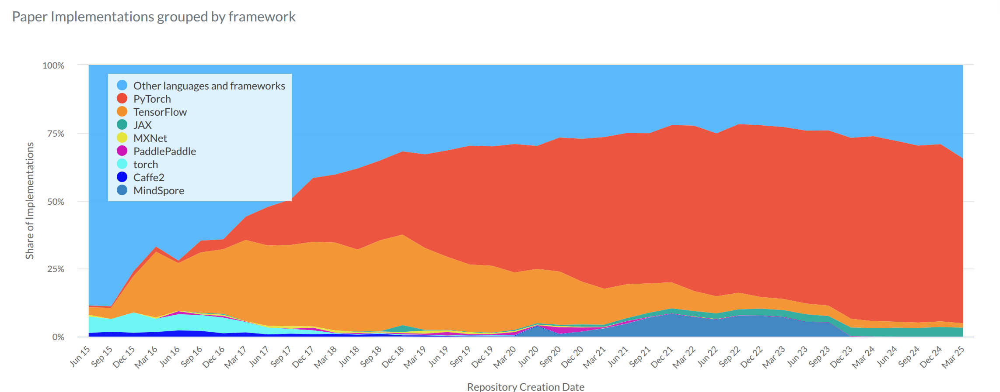

<h1 style="text-align: center;">开题报告</h1>

    研究主题：基于动态计算框架的神经网络算子并行加速库——mytorch

### **基本信息**

**团队成员信息：**（顺序无先后之分）

| 姓名   | 学号     |
| ------ | -------- |
| 陈兴平 | 22336037 |
| 刘华壹 | 22336149 |
| 罗弘杰 | 22336173 |

团队协作方式：通过 Github  的私有仓库，共同编辑代码以及报告。

### **选题说明**

#### **1. 选题背景**

深度学习的热潮开始于AlexNet开始，随着数据和算力的不断提高，科研和工程领域急需要深度学习框架加速模型开发和部署。由于深度学习主要设计矩阵的一系列计算，非常适合运用并行算法以及并行框架加速相关算子的计算。从Caffe,Tensorflow, 到PyTorch, DLF经过十年的发展，从创新各起，到PyTorch开始占据主流，如下图所示(来自PaperWithCode)到今天已经超过了50%以上的深度学习github repo由PyTorch开发。深入学习PyTorch的实现原理，从头到尾设计一个类似的深度学习框架，对于提高系统开发能力，并行程序，算法设计能力都有很大的帮助。

另外，虽然大部分的框架都是开源的，但是对于国产化的设备，比如摩尔线程，华为，寒武纪的计算卡，PyTorch相关的适配并不完善。同时随着大模型的快速发展，一些新的算子适配比较慢，比如FlashAttention, 企业有内部定制算子的需求，同时需要多卡，多机互联的机制， 相关前沿发展值得研究，这也是深度学习框架的一个重要发展方向。

#### **2. 相关工作**

**2.1 pytorch**

在当今神经网络研究领域，PyTorch已成为不可或缺的核心工具。作为Meta（原Facebook）开发的开源框架，它凭借动态图优先的设计哲学脱颖而出，通过`torch.autograd`在Python运行时动态构建计算图，这种机制相比TensorFlow等静态图框架更能满足科研场景的快速迭代需求。PyTorch不仅提供直观的Pythonic编程体验和高效的GPU加速能力，还集成了完整的深度学习工具链（如TorchVision、TorchText），并与Python生态无缝对接，同时通过TorchScript和ONNX支持实现便捷的模型部署。随着PyTorch 2.0引入编译优化技术并持续强化分布式训练与大模型支持（如Llama），该框架在保持科研灵活性的同时不断提升工业级性能，已成为贯穿算法探索到生产落地的首选平台。

以下是 pytorch 的框架图（使用 Mermaid 代码编写）：

### 2.2 前沿发展与挑战：从高性能算子到分布式训练

近年来，随着基于 Transformer 架构的大模型（如 LLM）迅猛发展，深度学习框架也面临新的性能瓶颈与架构挑战。为提升训练与推理效率，研究者和工业界从多个层面推进框架优化，涉及**新型高性能算子开发、算子融合机制、AI 编译器融合**以及**分布式并行训练策略**等。

####  高性能算子与 PyTorch 扩展的需求

以 FlashAttention [1]、Memory Efficient Attention [2] 和 Online-Softmax [3] 等为代表的优化注意力算子，正成为大模型优化的关键路径。比如：

- **FlashAttention** 通过在 CUDA kernel 中实现 fused softmax-attention，显著减少内存访问次数，相比 PyTorch 原生 `nn.MultiheadAttention` 拥有更低的显存开销和更高的吞吐。
- 以 DeepSeek 团队为例，其最新模型 **DeepSeekMoE** 和 **DeepSeek-V3** 分别在稀疏专家模型和注意力优化方面取得突破 [4][5]。尤其 DeepSeekMoE 中提出的动态专家选择机制和异构专家调度策略，充分暴露了 PyTorch 在稀疏计算和跨设备通信方面的短板。

然而，PyTorch 对这类新算子的原生支持往往滞后，企业与研究机构通常需要：

- 编写自定义 **C++/CUDA 扩展**（如 FlashAttention）。
- 使用 **Triton/TorchInductor** 实现新的 fused kernel。
- 封装为 `torch.library` 自定义算子，供高层模块调用。

PyTorch 对于这类前沿算子的支持目前依赖社区贡献，整合进主干代码的周期较长，因此其适应能力存在一定滞后。

#### 算子融合：从 kernel fusion 到 graph-level 编译

算子融合是当前优化框架性能的核心手段之一。传统 PyTorch 中，多个算子执行需要多次 CUDA kernel launch，带来显著的 overhead。而现代 AI 模型往往具有大量小规模操作（如 `LayerNorm + GELU + residual`），如果不能有效融合，就会导致严重的 GPU under-utilization。

为此，社区发展出以下技术路径：

- **Fused kernel**（如 Apex 的 fused layernorm、xFormers 中的 fused MHA）。
- **Triton**：[OpenAI Triton](https://github.com/openai/triton) 允许用 Python 写 GPU kernel，实现 block-level fusion。
- **TorchInductor / TorchDynamo**：PyTorch 2.x 引入的新编译子系统，支持自动追踪计算图、生成 IR，并利用 Inductor 自动生成高效的 fused kernel。

此外，PyTorch 也在学习 TVM / XLA 等编译器框架中的优势，尝试通过 `torch.compile()` 和 `torch._dynamo` 提供静态图和混合图编译能力。但目前的挑战包括：

- Kernel fusion 自动化程度仍然有限，依赖开发者编写 pattern。
- Triton 等工具的通用性尚不如传统 CUDA 工具链（如 cuDNN）。

#### 分布式训练：数据并行、模型并行与通信优化

随着参数规模从亿级扩展到百亿、万亿级别，**分布式训练机制**成为 PyTorch 框架性能的另一关键因素。目前 PyTorch 的核心支持包括：

| 并行方式 | PyTorch工具/生态 | 优缺点 |
|----------|------------------|--------|
| 数据并行 (DDP) | `torch.nn.parallel.DistributedDataParallel` | 稳定成熟，但通信开销大 |
| 模型并行 (MP) | Megatron-LM, deepspeed-pipe, fairscale | 控制难度大，手动分割模型 |
| 张量并行 (TP) | Megatron-LM, Colossal-AI | 支持大张量切片，但实现复杂 |
| 专家并行 (MoE) | DeepSpeed-MoE, GShard | 调度复杂，需要稀疏通信优化 |
| 混合并行 (FSDP) | `torch.distributed.fsdp` | 高效但调试成本高，接口不稳定 |

虽然 PyTorch 已支持 FSDP、DDP 和 RPC 等机制，但在以下方面仍存在不足：

- 通信算子（如 NCCL all_reduce）易成为瓶颈，缺乏高级融合优化。
- MoE 等稀疏并行机制支持有限，需依赖 DeepSpeed、FairScale 等外部工具。
- 不同并行策略之间的组合支持（如 TP + MoE + PP）仍缺乏通用接口。

#### **3. 研究意义**

通过实现类似pytorch框架，能够加深我们对于现代深度学习底层框架的理解，同时加深我们对于并行算法在实际工程应用情况的理解。

### **预期成果**

因为选题实现的复杂程度及难度较大，暂不知道能做到什么层次的成果。故我们的预期结果采用分层方式展现。

- **初级目标：**
  - [ ] 学习并复现 pytorch 的相关基础代码，比如张量构建、数据处理等
  - [ ] 实现一个全连接层网络的训练相关代码
- **中级目标：**
  - [ ] 设计一些个性化算子以支持实际应用，并取得加速效果
  - [ ] 完成神经网络，自动微分以及优化器的API的设计和实现

- **高级目标：**
  - [ ] 形成一个相对完整的计算框架
  - [ ] 尝试通过算子优化等方式，来加速前沿论文模型

### **参考资料**

- [[1912.01703\] PyTorch: An Imperative Style, High-Performance Deep Learning Library](https://arxiv.org/abs/1912.01703)
- [[2401.06066\] DeepSeekMoE: Towards Ultimate Expert Specialization in Mixture-of-Experts Language Models](https://arxiv.org/abs/2401.06066)
- [[2412.19437\] DeepSeek-V3 Technical Report](https://arxiv.org/abs/2412.19437)
- [pytorch/pytorch: Tensors and Dynamic neural networks in Python with strong GPU acceleration](https://github.com/pytorch/pytorch)
- [pytorch源码介绍-视频合集-哔哩哔哩视频](https://space.bilibili.com/373596439/lists?sid=57707&spm_id_from=333.788.0.0)

- [1] FlashAttention: https://github.com/Dao-AILab/flash-attention  
- [2] XFormers Efficient Attention: https://facebookresearch.github.io/xformers/  
- [3] Online Softmax paper: https://arxiv.org/abs/2107.12102  
- [4] DeepSeekMoE: https://huggingface.co/deepseek-ai/DeepSeekMoE  
- [5] DeepSeek-V3: https://github.com/deepseek-ai/DeepSeek-V3  
- [6] PyTorch TorchDynamo/TorchInductor: https://pytorch.org/get-started/pytorch-2.0/  
- [7] Triton OpenAI: https://github.com/openai/triton  
- [8] TVM: https://tvm.apache.org/

